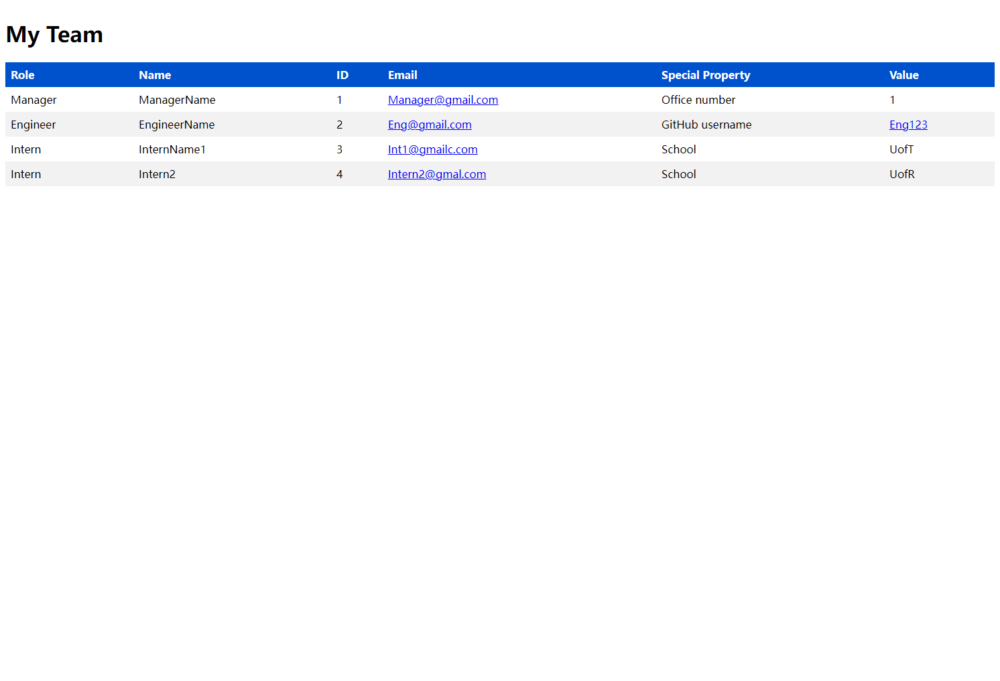

# Team Profile Generator

## Description

You can use the application to build a webpage that display all team members' basic information

## Table of Contents

- [Installation](#installation)
- [Usage](#usage)
- [License](#license)
- [Contributing](#contributing)
- [Tests](#tests)
- [Questions](#questions)
- [Example](#example)

## Installation

watch the video

## Usage

## License

This project is licensed under the [MIT](https://opensource.org/licenses/MIT) license.

## Contributing

## Tests
[Example Video](https://drive.google.com/file/d/17Dk-kj6qMDeXFCKOIWMGWxxKxTFl06lg/view?usp=share_link)

## Questions

For any questions or concerns, please contact me at yinggeberry@gmail.com. You can also visit my [GitHub profile](https://github.com/huyingg1).

## Example
[Example HTML Page](https://huyingg1.github.io/Team-Profolio-Generator.github.io/index.html)

